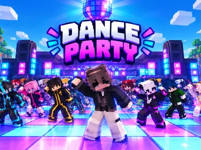
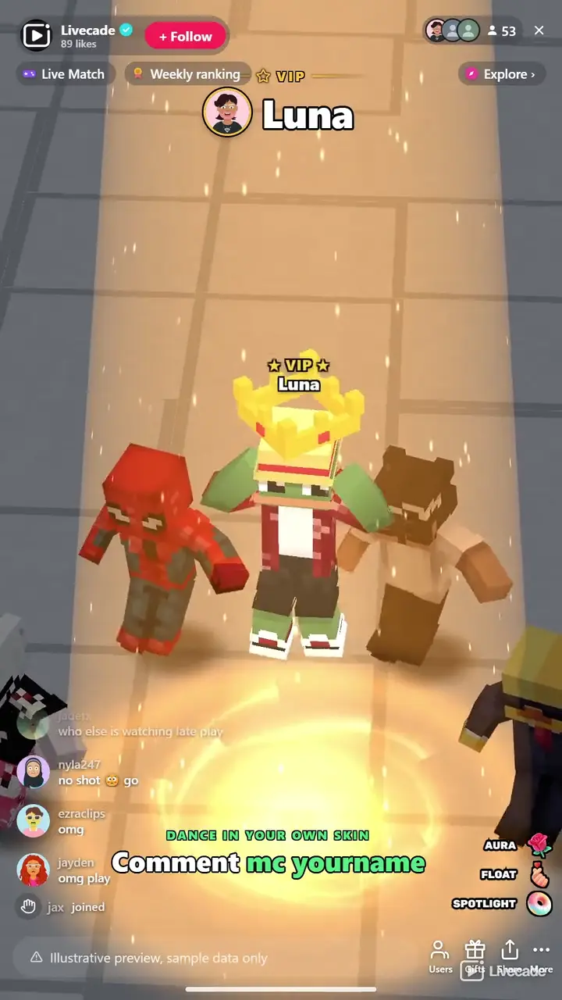

# Dance Party - Interactive TikTok Live Game

> Your chat dances in sync on your TikTok Live, in their own Minecraft skins.

Your viewers join a blocky dance floor and dance the same routine in sync, wearing their own Minecraft skins. Gifts buy them an aura, a float above the crowd, a solo in the spotlight or a giant VIP spot behind the floor.

**[Play Dance Party on Livecade](https://livecade.io/games/dance-party/?utm_source=github&utm_medium=readme&utm_campaign=dance-party)** - runs as a single browser source in OBS, Streamlabs, or TikTok LIVE Studio. Nothing for viewers to install.

## How viewers play

Viewers take part with the actions TikTok already gives them: **comments**, **gifts**, **likes**, **follows**, **shares**. Every action below is rebindable, so you decide which interaction drives which effect.

| Action | What it does |
| --- | --- |
| **Join the floor** | Puts the viewer on the dance floor in the front row. Any comment does it by default |
| **Aura** | A glowing energy column around the dancer, 30 seconds by default |
| **Float** | Lifts the dancer above the crowd for the whole stream; every repeat lifts them higher, up to five levels |
| **Spotlight** | Dims the floor and gives the dancer a solo dance under a spotlight, with a camera close-up |
| **VIP** | A gold solo moment, then the dancer stands giant behind the crowd with a VIP badge |

## How it works

### One routine, the whole crowd

Everyone on the floor dances the same full routine on the same beat, flash-mob style, from Macarena and Gangnam Style to salsa, samba and swing. Up to 300 dancers and 26 dances, 12 of which lock to the beat of the two songs on the music deck.

### Their own Minecraft skin

Viewers comment mc and their Minecraft username to dance in their own skin. Everyone else gets a skin from a pack of nearly 1,500, and a regular usually gets the same look every stream.

### Every moment on camera

Joins, auras, floats, spotlights and VIPs each take a turn on camera with the viewer's name in a banner. Your OBS source and your dashboard preview always show the same shot.

### Your controls beside the preview

Next dance, spotlight a random viewer, close-up on anyone by name, and tour the crowd, one click each, right next to the game in your dashboard.

## About the game

Dance Party turns your TikTok Live into a Minecraft-style dance floor. Everyone who comments drops onto the floor as a blocky dancer and joins the routine, so a busy chat becomes a crowd of up to 300 dancing the same moves on the same beat. The newest dancers land in the front row, right where the camera is looking.

### Dance in your own Minecraft skin

A viewer who comments mc followed by their Minecraft username dances in that player's skin. Everyone else gets one of nearly 1,500 built-in skins, so no two dancers look alike. A line on screen tells viewers the command, you can dance in your own skin too, and you can switch viewers' own skins off at any time.

### Gifts buy the spotlight

A Rose wraps a dancer in a glowing aura. A Finger Heart lifts them above the crowd, and every repeat lifts them higher. A Doughnut dims the floor, puts them in a spotlight and gives them a solo dance while the camera moves in. A Cap makes them a VIP: a gold solo moment, then they stand giant behind the crowd with a VIP badge. The viewer who has sent the most wears a crown.

### A camera that follows the party

Every new dancer and every gift gets its own turn on camera, one after another, with the viewer's name in a banner, so nobody is missed on a busy stream. When things go quiet the camera tours the crowd. From the dashboard you can change the dance, spotlight a random viewer, give anyone a close-up by searching their name, or start the crowd tour yourself.

## What it looks like on stream

[Watch Dance Party gameplay](https://cdn.livecade.io/games/dance-party.mp4)

## What you can configure

- **Language** - Thirteen languages for everything on screen
- **Map** - Sky Baseplate, Grass Plains, Sunset Beach, The Nether or Night Club
- **Dance** - One of 26 dances, or a new one after every dance
- **Max dancers** - From 20 up to 300, so a smaller PC can keep up while streaming
- **Dancers per row** - 4 to 16 across
- **Crowd tour** - The camera circles the crowd after 15 or 30 seconds of quiet, or never
- **Own skins** - Let viewers wear their own Minecraft skin, and show the command on screen
- **Your skin** - Dance first in your own Minecraft skin
- **Effect durations** - Float and VIP for the whole stream or a set time, and how long auras and spotlights last

## Languages

English, Spanish, Portuguese, French, German, Italian, Indonesian, Arabic, Turkish, Russian, Hindi, Romanian, Filipino

## FAQ

<strong>How do viewers join the dance?</strong>

By commenting. Out of the box any comment puts the viewer on the floor, and anyone who sends a gift joins too. You can change the join trigger to a keyword, likes, follows, shares or a gift.

<strong>How do viewers dance in their own Minecraft skin?</strong>

They comment mc followed by their Minecraft Java Edition username. Dance Party fetches that player's public skin and puts it on their dancer within a few seconds. You can turn own skins off in the settings, which puts everyone back in the built-in skins at once.

<strong>Is Dance Party an official Minecraft game?</strong>

No. Dance Party is a Livecade game and is not affiliated with or endorsed by Mojang or Microsoft. It shows the public skin of the Minecraft username a viewer types, and everyone else dances in Livecade's own built-in skins.

<strong>What do gifts do?</strong>

Out of the box, a Rose gives an aura, a Finger Heart makes a dancer float, a Doughnut gives a spotlight solo and a Cap makes them a VIP. Every action can be rebound to any gift, or to comments, likes, follows and shares.

<strong>What music does it play?</strong>

Two default songs are on the music deck, and 12 of the 26 dances lock to their beat. You can add your own tracks to the deck too.

<strong>Will Dance Party run on my PC?</strong>

It renders in 3D on the computer running your stream, so give it a reasonably modern machine. If your PC struggles while streaming, lower Max dancers in the settings.

<strong>How do I add Dance Party to my TikTok Live?</strong>

Add one browser source URL to OBS or TikTok LIVE Studio and go live. There is no plugin to install and nothing for your viewers to download.

## Setup

1. [Create a Livecade account](https://app.livecade.io/register?utm_source=github&utm_medium=cta&utm_campaign=dance-party)
2. Copy your overlay browser source URL
3. Paste it into OBS, Streamlabs, or TikTok LIVE Studio
4. Pick Dance Party, set your triggers, and go live

Runs in the browser, so it works on Windows and macOS with nothing to download. [See all TikTok Live games](https://livecade.io/tiktok-live-games/?utm_source=github&utm_medium=readme&utm_campaign=dance-party).

---

_This repository documents Dance Party, a hosted interactive game by [Livecade](https://livecade.io/?utm_source=github&utm_medium=footer&utm_campaign=dance-party). The game runs on Livecade's platform, so there is no source to install here._
